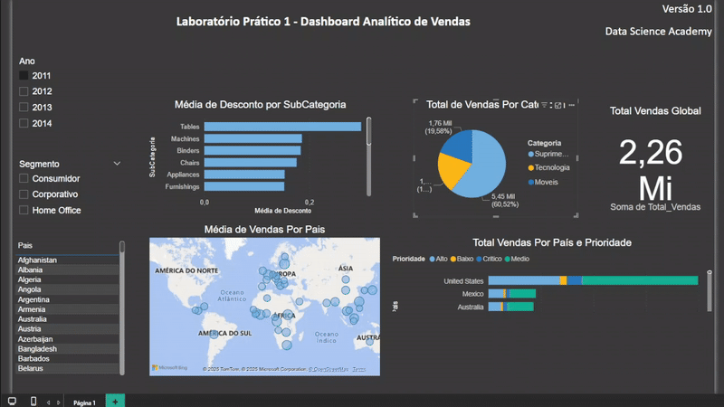
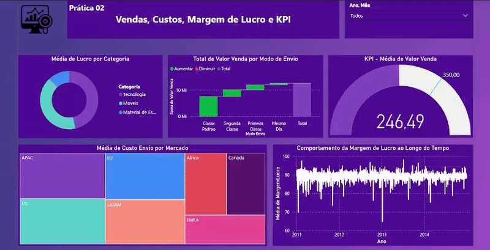
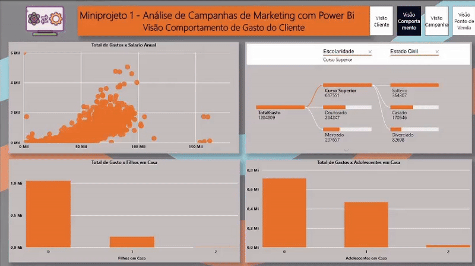
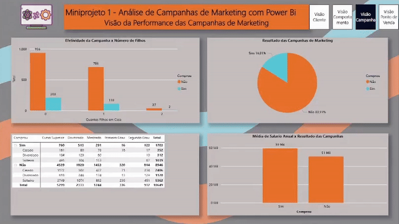
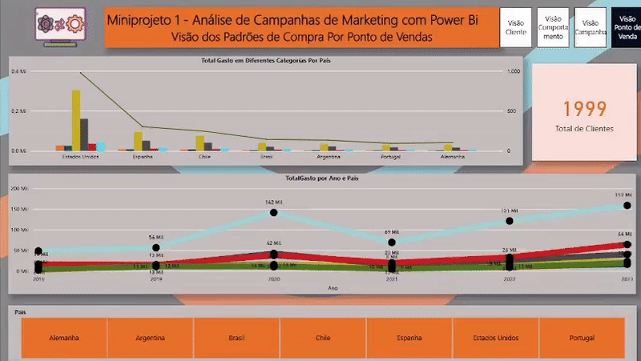
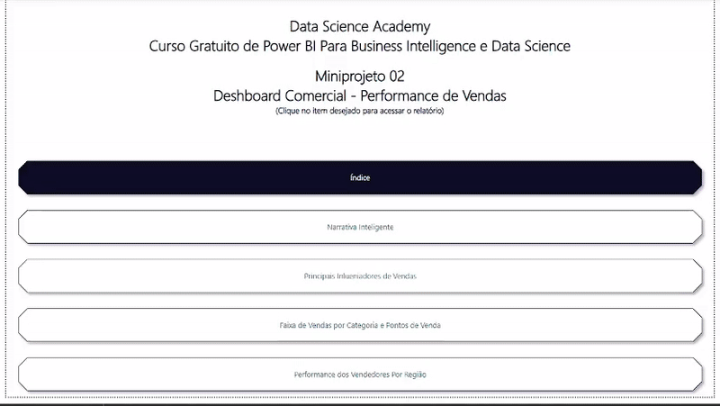

# Dashboard-Analítico-de-Vendas (Capítulo 02 - Prática 01)

## **Principais Perguntas Respondidas pelo Dashboard:**

1. **Qual o valor total vendido?**  
   → *Visualize o montante total de vendas em um único indicador, permitindo uma rápida avaliação do desempenho financeiro* (apresentado pelo componente **cartão** localizado no canto superior direito).  

2. **Quantas vendas foram realizadas por categoria de produto?**  
   → *Entenda a distribuição das vendas entre diferentes categorias, identificando quais produtos têm maior demanda* (disponível no gráfico de **pizza** na seção central do dashboard).  

3. **Quantas vendas foram realizadas por país, considerando a prioridade de entrega?**  
   → *Analise o volume de vendas por região e como a prioridade de entrega impacta a distribuição geográfica* (visualizado em um **gráfico de barras empilhadas** no canto inferior direito).  

4. **Qual foi a média de desconto aplicado por subcategoria de produto?**  
   → *Identifique padrões de descontos por subcategoria, auxiliando na definição de estratégias de precificação* (exibido em um **gráfico de barras clusterizadas** com filtros interativos, no canto superior esquerdo).  

5. **Quais países tiveram a maior média de valor de venda?**  
    → *Explore os mercados mais lucrativos em um **mapa geográfico interativo*** (localizado na parte inferior esquerdo do dashboard).  

## **Conclusão:**
   → *Nosso deshboard foi desenvolvido para ser intuitivo, dinâmico e altamente informativo, atendendo às necessidades de gestores, analistas e equipes comerciais. Com ele, você terá todas as infomações necessárias para otimizar estratégias, identificar oportunidades e impulsionar os resultados da sua empresa.*  

# Dashboard-Analítico-de-Vendas (Capítulo 03 - Prática 02)

# 📈 Dashboard de Análise de Vendas

## **Principais Perguntas Respondidas pelo Dashboard:**

1. **Análise Vendas por Modalidade de envio dos pedidos:**  
   → *Visualize o total de vendas por modo de envio de forma rápida* (apresentado através de um **gráfico de cascata** localizado na seção central do deashboard).  

2. **Custo Logístico por Mercado:**  
   → *Entenda o custo médio de envio dos produtos vendidos. O cálculo leva em consideração a região comercial e a média do custo de envio.* (disponível no gráfico **TreeMap** no canto inferior direito).  

3. **Monitoramento da Meta Comercial KPI - Ticket Médio:**  
   → *Analise o indicador KPI, filtrando por ano e mês, facilitando assim, a vizualização da meta mensalmente* (visualizado em um **indicador** no canto superior direito).  

4. **Considerando o Cálculo do Lucro, Qual Categoria de Produtos Apresentou Maior Lucro Médio?**  
   → *Identifique a média de lucro por catagoria.* (exibido em um **gráfico de rosca** no canto superior esquerdo).  

5. **Qual foi o Comportamento da Margem de Lucro?**  
    → *Explore os mercados mais lucrativos em um **mapa geográfico interativo*** (localizado na parte inferior esquerdo do dashboard).  

## **Conclusão:**
   → *Nosso deshboard foi desenvolvido para ser intuitivo, dinâmico e altamente informativo, atendendo às necessidades de gestores, analistas e equipes comerciais. Com ele, você terá todas as infomações necessárias para otimizar estratégias, identificar oportunidades e impulsionar os resultados da sua empresa.*  

## Mini Projeto 01: Análise de Marketing - Visão do Cliente  (Capítulo 04- Prática 03)

## **Principais Perguntas Respondidas pelo Dashboard:**

1. **Qual o total de clientes registrados na nossa base de dados?**  
   → *Visualize o total de clientes em um único indicador, utilizamos a coluna **"ID"** da nossa planilha* (apresentado pelo componente **cartão** localizado na seção superior esquerda do relatório).  

2. **Qual a média salarial dos clientes?**  
   → *Identificaremos a média salarial dos cadastros da nossa base de dados, por meio da coluna **"Salário Anual"*** (disponível no **cartão** na seção superior esquerda do dashboard).  

3. **Qual o número total de compras realizadas nas lojas físicas?**  
   → *Analise o volume de vendas realizadas presencialmente, por meio da coluna **"Número de Compras na Loja"*** (visualizado no componente **cartão** na seção central do relatório).  

4. **Qual o total de compras realizadas pela internet?**  
   → *A identificação dessa parcela de vendas se deu através da coluna **"Núemro de Compras na Web"*** (exibido em um **cartão** na seção superior do deashboard).  

5. **Quantas compras foram finalizadas com desconto?**  
    → *Visualize o total de compras fechadas com descontos por meio de um  **cartão**, para obertemos essa métrica utilizamos a coluna **"Número de Compras com Desconto"*** (localizado na parte direita da seção superior do relatório).  

6. **Quantas compras foram realizadas via catálogo?**  
    → *Observe o total de compras efetivadas através de catálogos em um **cartão**, a métrica foi obtida por meio da coluna **"Número de Compras via Catálogo"*** (exibido na parte direita da seção superior do relatório).  

7. **Qual o grau de escolaridade dos clientes?**  
    → *Identificaremos a distribuição dos clientes por grau de escolaridade utilizando as colunas **"ID"** e **"Escolaridade"** da nossa base de dados. O resultado será exibido através de um **gráfico de barras*** (localizado na parte esquerda da seção central).  

8. **Qual a distribuição dos clientes por "Estado Civil"?**  
   → *Identificaremos a dmétrica por meio das colunas **"ID"** e **"Estado Civil"** dos dados. O resultado está apresentado em um **gráfico de barras*** (apresentado na parte direita da seção central).  

9. **Por fim, como podemos filtrar a localização dos clientes?**  
   → *A identificação da locacalização por país utiliza a coluna **"País"** e o componente **segmentação de dados** formatado em **bloco**, assim o filtro se torna mais dinânmico.* (localizado na parte inferior).  

## **Conclusão:**
   → *Nosso relatório foi elaborado para ser acessível, descomplicado e informativo, atendendo às necessidades de gestores, analistas e equipes comerciais. Com ele, você obterá todos os dados essenciais para aprimorar táticas, detectar chances e potencializar o desempenho do seu negócio.*  

## Mini-Projeto 01: Análise de Marketing - Visão Comportamento de Gasto do Cliente (Capítulo 04- Prática 03)

## **Principais Perguntas Respondidas pelo Dashboard:**
**_Antes de respondermos as nossas perguntas precisamos criar uma nova "medida" no Power BI, usando DAX: o "Total Gasto", que soma os gastos de cada uma das seis categoria para cada um dos ID's cadastrados._** 

1. **Quala relação entre o "Salário Anual" e o "Total Gasto" dos clientes?**  
   → *Usaremos um elemento **"gráfico de dispersão"** para exibir a relação entre **Salário Anual** e o **Total Gasto** por cada cliente.* (localizado na seção superior esquerda do relatório).  

2. **Existe relção entre "Total Gasto" e "Número de Filhos"?**  
   → *Usaremos dois **"gráficos de barras"** para identificar o **"Total Gasto"** dos clientes com e sem **"Crianças em Casa"** e, no segundo gráfico, **"Adolescentes em Casa"*** (disponíveis na seção superior inferios do dashboard).  

3. **Iremos analisar o "Total Gasto" por "Escolaridade" e "Estado Civil".**  
   → *Para realizarmos a análise usaremos um elemento **"Árvore Hierárquica"** para cruzar os dados de **"Total Gasto"** com as colunas **"Escolaridade"** e **"Estado Civil"**, concluindo assim a análise do perfil de gastos dos clientes cadastrados em nossa base de dados. (visualizado na seção superior direita do relatório).  

## **Conclusão:**
   → *Nosso relatório foi elaborado para ser descomplicado, informativo e acessível. Com ele, você obterá todos os dados essenciais sobreo perfil de gastos dos clientes, aprimorando assim, as táticas e  e campanhas de Marketing para potencializar o desempenho do seu negócio.*  

## Mini-Projeto 01: Análise de Marketing - Visão da Performance das Campanhas de Venda (Capítulo 04- Prática 03)

## **Principais Perguntas Respondidas pelo Dashboard:**

1. **Qual a efetividade geral das campanhas de Marketing?**  
   → *A partir dos dados da coluna **"Comprou"** comparados à coluna **"ID"** faremos uma contagem dos clientes que responderam positivamente as campanhas de Marketing da empresa.(apresentado mno relatório pelo componente **gráfico de pizza**, localizado na seção superior direita do relatório).* 

2. **Será que há diferença entre a média salarial dos clientes entre aqueles que compraram ou não durante as campanhas de Marketing?**  
   → *Usaremos as colunas **"Comprou"** e **"Salário Anual"** em um **gráfico de barras** para demonstrar a relação entre a média salarial dos clientes que compraram ou não em resposta as campanhas de Marketing.* (disponível na seção inferior direita do dashboard).  

3. **Qual a influência do web site da empresa no número de vendas durante as campanhas de Marketing?**  
   → *Faremos uso de uma **matriz** para cruzar várias colunas e informações diferentes, fornecendo assim um maior detalhamento aos tomadores de decisões.* (visualizado na seção inferior esquerda).  

4. **Na última pergunta deste relatório, analisaremos se ter **"Filhos em casa"** influenciou na efetividade das campanhas de Marketing.**  
   → *Faremos uso de um **"gráfico de barras"** cruzando os dados de duas colunas da nossa base: **"Filhos em Casa"** e **"Comrprou"***" (gráfico na seção superior direitaesquerda do deashboard).  

## **Conclusão:**
   → *Nosso deshoard foi desenvolvido atendendo às necessidades de gestores, analistas e equipes comerciais. Por meio de campanhas estratégicas e análises de mercado, o time de Marketing criou essa ferramenta para que você reúna conhecimentos essenciais — potencializando abordagens, identificando vantagens competitivas e maximizando os retornos da empresa.*  

## Mini-Projeto 01: Análise de Marketing - Visão dos Padrões de Compra Por Ponto de Vendas (Capítulo 04- Prática 03)

## **Principais Perguntas Respondidas pelo Dashboard:**

1. **Análise do "Total Gasto" por categoria e país.**  
   → *Para  realizarmos a análise utilizaremos o **gráfico de colunas agrupadas e linha** para cruzarmnos os dados de **"País"**, **"ID"**, **"Gastos com Alimentos"**, **"Gastos com Brinquedos"**,**"Gastos com Eletrônicos"**, **"Gastos com Móveis"**,**"Gastos com Utilidades"** e **"Gastos com Vestuário"**. Além disso, foi incluido um elemento **cartão** que destaca o número de clientes cadastraos por país.(apresentado na seção superior do relatório).  

2. **Análise do "Total Gasto" por país ao longo do tempo.**  
   → *Usaremos um  **gráfico de linha**  para nos fornecer a evolução do **"Total Gasto"** ao longo dos anos em cada país que a loja atua.* (disponível na seção inferior do dashboard).  

3. **Por fim, como podemos filtrar a localização dos clientes?**  
   → *A identificação da locacalização por país utiliza a coluna **"País"** e o componente **segmentação de dados** formatado em **bloco**, assim o filtro se torna mais dinânmico.* (localizado na parte inferior).  

## **Conclusão:**
   → *Nosso deshoard objetiva atender  às necessidades de gestores, analistas e equipes comerciais. Com ele, você terá todas as infomações necessárias para otimizar estratégias, identificar oportunidades e impulsionar os resultados da sua empresa.* 

## Mini-Projeto 02: Dashboard Comercial - Performance de Vendas (Capítulo 05- Prática 04)

## Este mini-projeto traz uma breve introdução à análise de dados comerciais com o Power BI.

**Foram construidas diversas visualizações para compreender a performance de vendas de uma empresa fictícia por diferente ângulos: Narrativa Inteligente; Principais Influenciadores; Gráfico de Faixas e criação de um Menu para Índice do Desheboard.** 

*Foram utilizados dados fictícios para este projeto.*

## **Conclusão:**
   → *Este mini-projeto ofereceu uma introdução prática à análise de dados comerciais utilizando o Power BI, destacando sua capacidade de transformar informações brutas em insights valiosos para a tomada de decisões. Através da visualização interativa e de ferramentas intuitivas, é possível identificar tendências, otimizar processos e impulsionar resultados estratégicos* 

