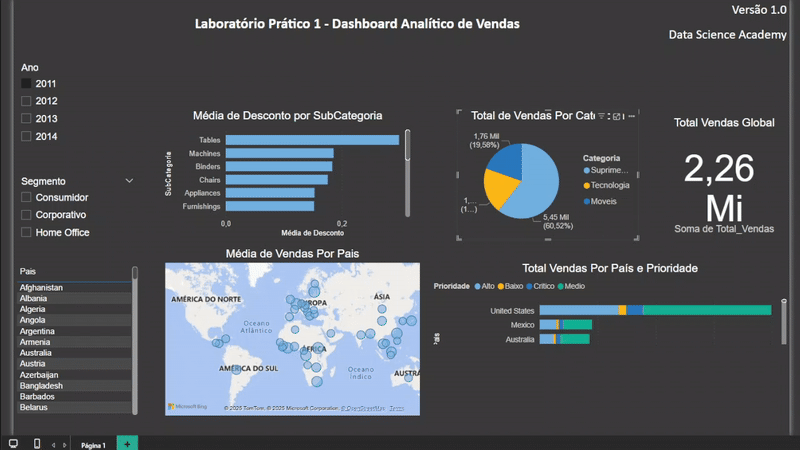

# Dashboard-Analitico-de-Vendas

Demonstrativo da prática de construção de Deshboards no curso de Microsoft Power BI para Business Intelligence e Ciência de Dados.

## **Principais Perguntas Respondidas pelo Dashboard:**

1. **Qual o valor total vendido?**  
   → *Visualize o montante total de vendas em um único indicador, permitindo uma rápida avaliação do desempenho financeiro* (apresentado pelo componente **cartão** localizado no canto superior direito).  

2. **Quantas vendas foram realizadas por categoria de produto?**  
   → *Entenda a distribuição das vendas entre diferentes categorias, identificando quais produtos têm maior demanda* (disponível no gráfico de **pizza** na seção central do dashboard).  

3. **Quantas vendas foram realizadas por país, considerando a prioridade de entrega?**  
   → *Analise o volume de vendas por região e como a prioridade de entrega impacta a distribuição geográfica* (visualizado em um **gráfico de barras empilhadas** no canto inferior direito).  

4. **Qual foi a média de desconto aplicado por subcategoria de produto?**  
   → *Identifique padrões de descontos por subcategoria, auxiliando na definição de estratégias de precificação* (exibido em um **gráfico de barras clusterizadas** com filtros interativos, no canto superior esquerdo).  

5. **Quais países tiveram a maior média de valor de venda?**  
    → *Explore os mercados mais lucrativos em um **mapa geográfico interativo*** (localizado na parte inferior esquerdo do dashboard).  

## **Conclusão:**
   → *Nosso deshboard foi desenvolvido para ser intuitivo, dinâmico e altamente informativo, atendendo às necessidades de gestores, analistas e equipes comerciais. Com ele, você terá todas as irfomações necessárias para otimizar estratégias, identificar oportunidades e impulsionar os resultados da sua empresa.*  
